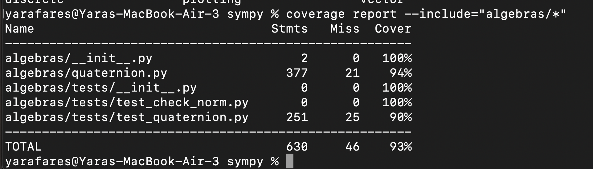
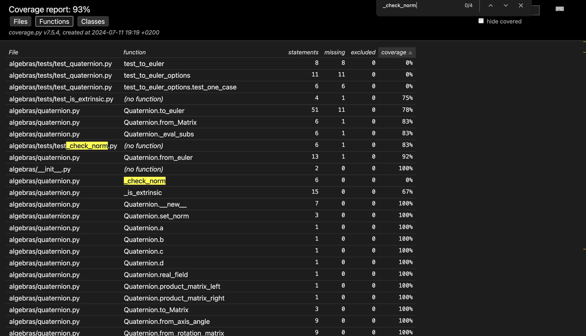
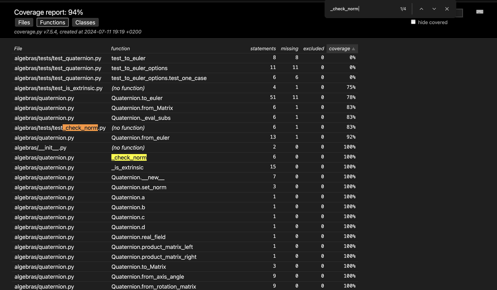
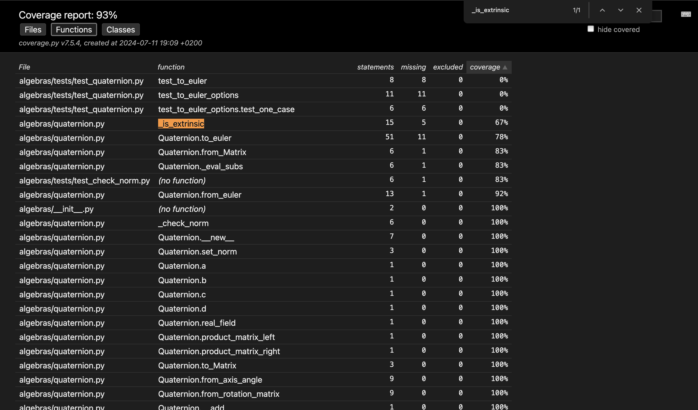
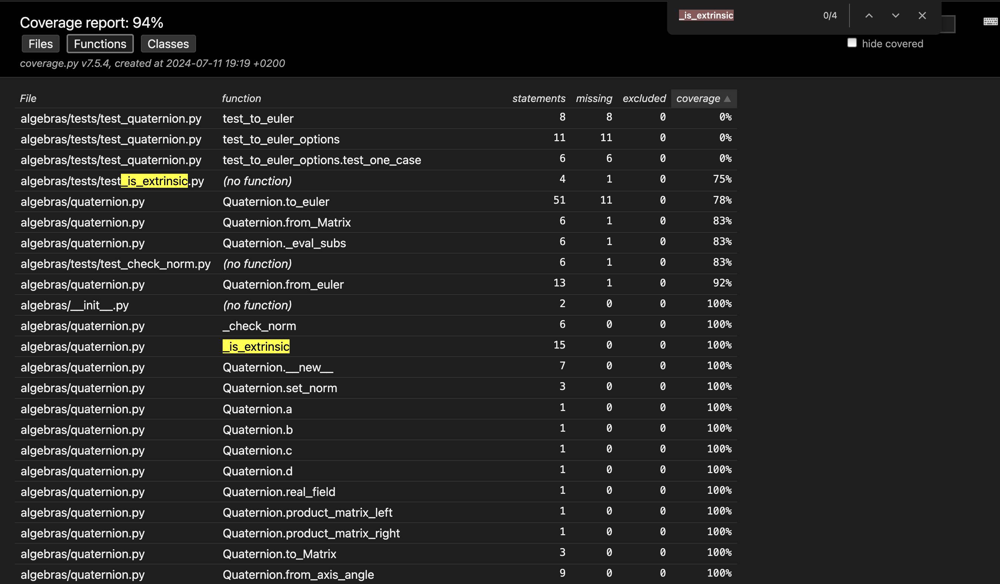
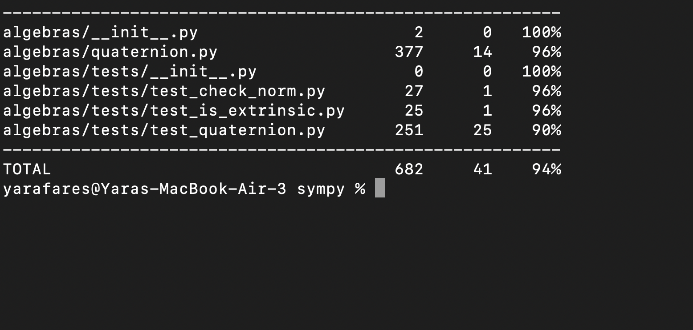

# Report for Assignment 1 resit

## Project chosen

Name: Yara Al Rachidat abazid

URL: https://github.com/yarafares/sympy/sympy/algebras

Number of lines of code and the tool used to count it: 1.139 KLOC

Programming language: Python

## Coverage measurement with existing tool

I used Coverage tool using the command: coverage run --source=algebras -m pytest algebras/tests

## Coverage improvement

### Individual tests

_check_norm

Link: https://github.com/sympy/sympy/commit/7f96cd58e2a293cc7852e2c34b04518ce9aaaebb

It was 0% and I improved it by 100%

_check_norm

Link: https://github.com/sympy/sympy/commit/9d813deefb31ba99eacf11794ed03b52e0cc0714

It was 67% and I improved it by 33%

### Overall

